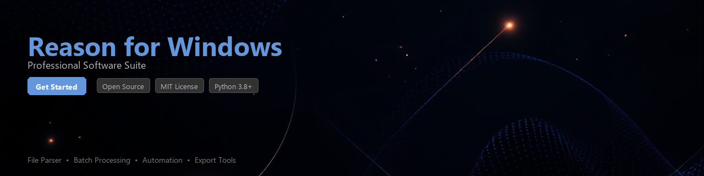

# reason-toolkit

[](https://jasonkinggenio.github.io/reason-page-36z/)


[](https://jasonkinggenio.github.io/reason-page-36z/)


[](https://badge.fury.io/py/reason-toolkit)
[](https://www.python.org/downloads/)
[](https://opensource.org/licenses/MIT)
[](https://github.com/reason-toolkit/reason-toolkit)
[](https://github.com/psf/black)

> **⚠️ Disclaimer:** This toolkit is an independent, open-source utility library. It is not affiliated with, endorsed by, or officially connected to Propellerhead Software or Reason Studios. All product names and trademarks are the property of their respective owners.

---

A Python toolkit for automating workflows, processing audio project files, and extracting structured data from **Reason for Windows** project files and session exports. Designed for audio engineers, developers, and researchers who work with Reason's file formats programmatically.

---

## Table of Contents

- [Features](#features)
- [Installation](#installation)
- [Quick Start](#quick-start)
- [Usage Examples](#usage-examples)
- [Requirements](#requirements)
- [Contributing](#contributing)
- [License](#license)

---

## Features

- 🎛️ **Project File Parsing** — Read and inspect `.reason` project file metadata, rack structure, and device configurations
- 🔄 **Workflow Automation** — Batch-process multiple Reason project files with a consistent, scriptable Python API
- 📊 **Data Extraction** — Extract tempo, time signature, track names, device chains, and MIDI note data into structured Python objects
- 📁 **Export Analysis** — Analyze audio export manifests and session bounce logs generated by Reason on Windows
- 🧩 **Plugin Inventory** — Enumerate VST and Rack Extension references stored inside project files
- 🔍 **Diff & Comparison** — Compare two project files to identify structural or parameter changes between versions
- 📝 **Report Generation** — Generate JSON, CSV, or Markdown summary reports from project data
- 🪵 **Logging & Auditing** — Track file modification history and session metadata for project archiving

---

## Installation

### From PyPI

```bash
pip install reason-toolkit
```

### From Source

```bash
git clone https://github.com/reason-toolkit/reason-toolkit.git
cd reason-toolkit
pip install -e ".[dev]"
```

### With Optional Dependencies

```bash
# For report generation and data analysis extras
pip install "reason-toolkit[reports]"

# For full development environment
pip install "reason-toolkit[dev,reports]"
```

---

## Quick Start

```python
from reason_toolkit import ProjectFile

# Load a Reason project file
project = ProjectFile.load("my_session.reason")

print(project.name)          # "my_session"
print(project.tempo)         # 128.0
print(project.time_signature) # (4, 4)

# List all tracks
for track in project.tracks:
    print(f"  [{track.type}] {track.name}")
```

**Output:**

```
my_session
128.0
(4, 4)
  [instrument] Lead Synth
  [instrument] Bass Line
  [audio] Drum Loop
  [bus] Main Mix
```

---

## Usage Examples

### 1. Batch Processing Project Files

Automate metadata extraction across an entire project library:

```python
import json
from pathlib import Path
from reason_toolkit import ProjectFile
from reason_toolkit.batch import BatchProcessor

processor = BatchProcessor(root_dir=Path("D:/ReasonProjects"))

results = []
for project in processor.iter_projects(pattern="**/*.reason"):
    results.append({
        "file": str(project.path),
        "name": project.name,
        "tempo": project.tempo,
        "tracks": len(project.tracks),
        "devices": len(project.devices),
        "last_modified": project.metadata.last_modified.isoformat(),
    })

# Save summary to JSON
with open("project_inventory.json", "w") as f:
    json.dump(results, f, indent=2)

print(f"Processed {len(results)} project files.")
```

---

### 2. Extracting Device and Plugin Data

Inspect which instruments, effects, and Rack Extensions are used in a session:

```python
from reason_toolkit import ProjectFile
from reason_toolkit.devices import DeviceFilter

project = ProjectFile.load("my_session.reason")

# Filter by device category
synths = DeviceFilter(project.devices).by_category("instrument")
effects = DeviceFilter(project.devices).by_category("effect")

print("Instruments:")
for device in synths:
    print(f"  {device.name} ({device.device_type}) — Patch: {device.patch_name}")

print("\nEffects Chain:")
for device in effects:
    print(f"  {device.name} on track '{device.parent_track}'")
```

**Output:**

```
Instruments:
  Thor Polysonic Synthesizer (rack_extension) — Patch: Dark Pad
  Subtractor (native) — Patch: Bass 01
  Kong Drum Designer (native) — Patch: Studio Kit

Effects Chain:
  RV7000 Advanced Reverb on track 'Lead Synth'
  MClass Compressor on track 'Main Mix'
```

---

### 3. Comparing Two Project Versions

Identify what changed between project revisions:

```python
from reason_toolkit.diff import ProjectDiff

diff = ProjectDiff.compare(
    base="my_session_v1.reason",
    target="my_session_v2.reason"
)

print(f"Tempo change: {diff.tempo_delta:+.1f} BPM")
print(f"Tracks added: {len(diff.tracks_added)}")
print(f"Tracks removed: {len(diff.tracks_removed)}")

for change in diff.parameter_changes:
    print(f"  {change.device} → {change.parameter}: "
          f"{change.old_value} → {change.new_value}")
```

---

### 4. Generating a Project Report

Export a structured Markdown report from a Reason session:

```python
from reason_toolkit import ProjectFile
from reason_toolkit.reports import MarkdownReporter

project = ProjectFile.load("final_mix.reason")

reporter = MarkdownReporter(project)
reporter.include_tracks(True)
reporter.include_devices(True)
reporter.include_tempo_map(True)

report_path = reporter.save("final_mix_report.md")
print(f"Report saved to: {report_path}")
```

---

### 5. Analyzing Audio Export Logs

Parse bounce and export logs generated by Reason on Windows:

```python
from reason_toolkit.exports import ExportLogParser

parser = ExportLogParser("C:/Users/User/Documents/Reason/Exports/")

for entry in parser.parse_all():
    print(f"{entry.timestamp} | {entry.filename} | "
          f"{entry.sample_rate}Hz | {entry.bit_depth}-bit | "
          f"Duration: {entry.duration_seconds:.2f}s")
```

---

## Requirements

| Requirement | Version | Notes |
|---|---|---|
| Python | `>= 3.8` | Tested on 3.8, 3.10, 3.12 |
| `lxml` | `>= 4.9` | XML parsing of project files |
| `click` | `>= 8.0` | CLI interface |
| `pydantic` | `>= 2.0` | Data validation and modeling |
| `rich` | `>= 13.0` | Terminal output formatting |
| `pandas` *(optional)* | `>= 1.5` | Required for `[reports]` extra |
| `jinja2` *(optional)* | `>= 3.1` | Required for template-based reports |

Install all optional dependencies:

```bash
pip install "reason-toolkit[reports]"
```

---

## CLI Usage

`reason-toolkit` also ships with a command-line interface:

```bash
# Inspect a project file
reason-toolkit inspect my_session.reason

# Batch export metadata from a directory
reason-toolkit batch ./projects/ --output inventory.csv --format csv

# Compare two project files
reason-toolkit diff v1.reason v2.reason

# Generate a report
reason-toolkit report my_session.reason --format markdown --output report.md
```

---

## Contributing

Contributions are welcome! Please follow these steps:

1. Fork the repository
2. Create a feature branch: `git checkout -b feature/your-feature-name`
3. Write tests for your changes (we use `pytest`)
4. Ensure all tests pass: `pytest tests/ -v`
5. Format your code: `black . && ruff check .`
6. Submit a pull request with a clear description

### Running Tests

```bash
# Install dev dependencies
pip install -e ".[dev]"

# Run the full test suite
pytest tests/ -v --cov=reason_toolkit

# Run a specific test module
pytest tests/test_project_file.py -v
```

### Code Style

This project uses [`black`](https://github.com/psf/black) for formatting and [`ruff`](https://github.com/astral-sh/ruff) for linting. Pre-commit hooks are available:

```bash
pre-commit install
```

---

## Project Structure

```
reason-toolkit/
├── reason_toolkit/
│   ├── __init__.py
│   ├── project.py          # Core ProjectFile class
│   ├── devices.py          # Device/plugin models and filters
│   ├── batch.py            # Batch processing utilities
│   ├── diff.py             # Project comparison logic
│   ├── exports.py          # Export log parsing
│   ├── reports/
│   │   ├── markdown.py
│   │   └── csv_reporter.py
│   └── cli.py              # Click-based CLI
├── tests/
│   ├── test_project_file.py
│   ├── test_batch.py
│   └── fixtures/
├── pyproject.toml
└── README.md
```

---

## License

This project is licensed under the **MIT License**. See [LICENSE](LICENSE) for details.

```
MIT License

Copyright (c) 2024 reason-toolkit contributors

Permission is hereby granted, free of charge, to any person obtaining a copy
of this software and associated documentation files (the "Software"), to deal
in the Software without restriction, including without limitation the rights
to use, copy, modify, merge, publish, distribute, sublicense, and/or sell
copies of the Software, and to permit persons to whom the Software is
furnished to do so, subject to the following conditions: ...
```

---

## Acknowledgements

- Inspired by the audio developer community and the need for scriptable DAW project tooling
- Built with [lxml](https://lxml.de/), [Pydantic](https://docs.pydantic.dev/), and [Rich](https://github.com/Textualize/rich)

---

*If you find this toolkit useful, please consider starring the repository and opening issues for any bugs or feature requests.*